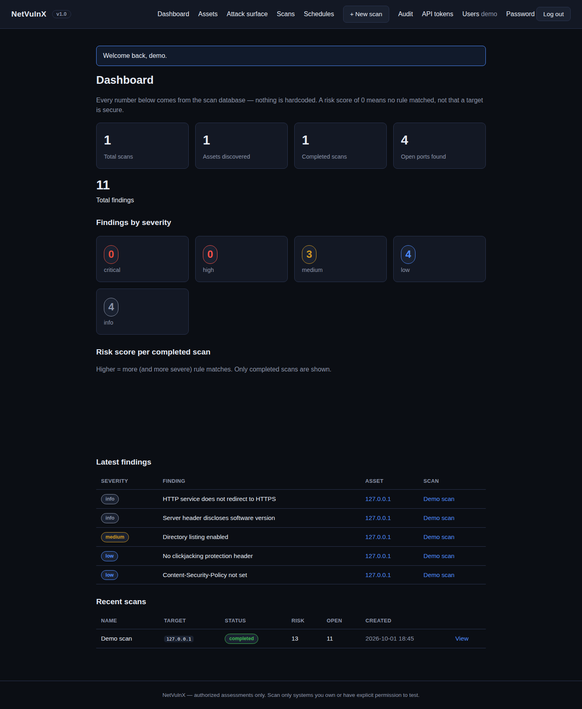
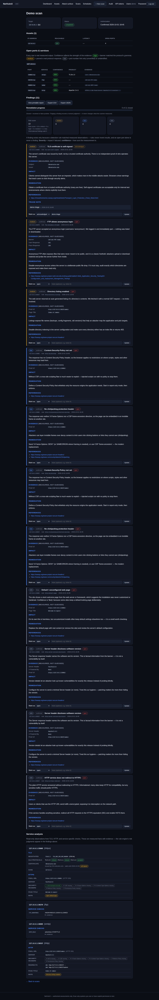
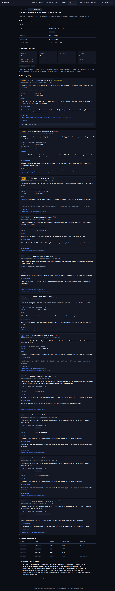

# NetVulnX — Network Vulnerability Scanner & Risk Assessment Platform


A **real, safe-by-design network vulnerability assessment platform** for
authorized environments — your own machines, lab VMs, and private networks
you have permission to test. Not a port-scan wrapper: NetVulnX fingerprints
services, analyzes TLS/HTTP/SSH posture, maps CVEs, scores risk
explainably, tracks remediation, and watches for drift on a schedule.

## Screenshots

From a real scan of a lab target (11 findings, risk score 13):

| Dashboard | Scan findings | Printable report |
|---|---|---|
|  |  |  |

## What it does

**Scanning**
- TCP connect port scanning with bounded parallelism and scan profiles
  (quick / standard / custom), plus banner grabbing and service
  fingerprinting with confidence levels
- TLS analysis: certificate validity/expiry/hostname, protocol and cipher
  grading, self-signed detection
- HTTP analysis: security headers, HTTPS redirects, default pages,
  directory listings
- **SSH algorithm audit** — performs the real SSH handshake (KEXINIT) and
  grades key exchange, host-key, cipher and MAC algorithms, with exact
  `sshd_config` remediation. No login attempted, ever
- Safe service checks: DNS version, SMTP STARTTLS/EHLO, FTP anonymous login
- **UDP service discovery** — protocol probes (DNS, SNMP, NTP, NetBIOS-NS)
  with honest open vs open|filtered semantics; default SNMP community
  detection
- **SMB analyzer** — real SMB2/SMB1 negotiate handshakes (no auth): SMBv1
  detection, signing-required check, dialect grading
- **RDP analyzer** — real X.224 handshake (no auth): detects plain-RDP
  vs TLS vs NLA (CredSSP) negotiation
- **Email password resets** — single-use hashed tokens, 1-hour expiry,
  rate-limited, no user enumeration
- **Database analyzers** — MySQL handshake version/EOL, PostgreSQL TLS probe,
  Redis auth check (all read-only, no login)
- **Authenticated checks** — optional SSH credentials (memory-only, never
  stored) for a read-only `sshd -T` config audit
- **Network topology** — observed hosts grouped in /24 zones, server-side SVG
- **Drift baselines** — pin a scan per target, track new/gone findings vs latest
- **i18n** — English/Hindi UI, zero-dependency JSON catalogs
- CVE mapping: product+version → real NVD lookups with CVSS-based severity
  (7-day cache, honest "likely" confidence — never fabricated)

**Assessment workflow**
- Deterministic rule engine: every finding carries measured evidence,
  confidence, impact, remediation and references
- Explainable risk scoring — no black-box numbers
- Finding triage (open / acknowledged / resolved / false positive) with
  notes, remediation progress tracking, and scan-to-scan diff
  (new/gone findings, opened/closed ports, risk delta)
- Printable HTML reports (browser Print → PDF), CSV/JSON exports

**Team & operations**
- Authentication with brute-force lockout, password change, and secure
  session cookies; viewer / operator / admin roles with user management
- API tokens (Bearer auth) for `/api/*`, append-only audit log
- Scheduled daily/weekly scans with drift alerts via webhooks
- Alembic database migrations, Docker + Docker Compose deployment,
  HTTPS reverse-proxy recipe

## What makes it different

1. **Honest by architecture.** An open port is an observation, not a
   vulnerability. Every finding must have measured evidence — the engine
   literally cannot invent results.
2. **SSH crypto auditing.** Most scanners read the SSH banner and stop.
   NetVulnX completes the handshake and grades the actual cryptography.
3. **Explainable risk.** The risk score is a documented formula over
   finding severities, not a black box.
4. **Safety is a feature.** Target scope validation, an explicit
   authorization gate before any packet is sent, no brute force, no
   exploitation, no DoS — enforced in code and tested (229 unit tests).

## Safety first

- Only `127.0.0.1` / `::1` and private addresses (`10.x`, `172.16–31.x`,
  `192.168.x`) are scannable by default. Public IPs are rejected unless
  explicitly opted in via `config.py` (`ALLOW_PUBLIC_TARGETS`).
- Every scan requires explicit authorization confirmation before any
  packet is sent. The confirmation is stored with the scan record.
- Scan only systems you own or have written permission to test.

## Quickstart

You need Python 3.10+.

```bash
# 1. Create an isolated Python environment
python3 -m venv venv

# 2. Activate it
source venv/bin/activate        # Windows: .\venv\Scripts\Activate.ps1

# 3. Install dependencies
pip install -r requirements.txt

# 4. Run the tests
python -m pytest tests/ -q

# 5. Start the app
python run.py
```

Then open **http://127.0.0.1:5000** — create your admin account on the
first-run setup page, and try a scan: target `127.0.0.1`, ports `80,443,22`.

Prefer Docker? See [`docs/DEPLOYMENT.md`](docs/DEPLOYMENT.md) for the
Compose quickstart and the HTTPS reverse-proxy recipe.

## Project layout

```
netvulnx/
├── run.py                 # start the app: `python run.py`
├── config.py              # all settings in one place (safety controls live here)
├── requirements.txt       # Python dependencies
├── Dockerfile / docker-compose.yml
├── app/                   # Flask app: routes, models, templates, audit, auth
├── scanner/               # scan engine: targets, reachability, portscan,
│                          #   fingerprinting, TLS/HTTP/SSH/service checks,
│                          #   CVE lookup, scheduling, webhooks
├── rules/                 # deterministic rule engine (TLS/HTTP/service/
│                          #   CVE/SSH rules + risk scoring)
├── migrations/            # Alembic versioned schema migrations
├── tests/                 # 229 pytest unit tests
└── docs/                  # architecture, testing, security, deployment…
```

## Milestones

| # | Milestone | # | Milestone |
|---|---|---|---|
| 1 | Foundation & safety gate | 10 | Scheduled scans + drift alerts |
| 2 | Port scanning + fingerprinting | 11 | CSV/JSON exports |
| 3 | TLS/HTTP analysis | 12 | Alembic migrations |
| 4 | Rule engine + risk scoring | 13 | Login hardening |
| 5 | Dashboard + attack-surface view | 14 | API tokens |
| 6 | Reports + triage + scan diff | 15 | Team roles (RBAC) |
| 7 | Testing + hardening + docs | 16 | Webhook notifications |
| 8 | Authentication + prod server | 17 | Docker deployment |
| 9 | CVE mapping (NVD) | 18 | SSH algorithm analyzer |
| 20 | SMB/RDP analyzers + email password resets | 19 | UDP service discovery |
| 21 | DB analyzers, auth checks, topology, baselines, i18n |  |  |

## Documentation

- [`docs/USER_GUIDE.md`](docs/USER_GUIDE.md) — using the app day to day
- [`docs/DEPLOYMENT.md`](docs/DEPLOYMENT.md) — Docker, HTTPS, production checklist
- [`docs/ARCHITECTURE.md`](docs/ARCHITECTURE.md) — how the pieces fit together
- [`docs/SECURITY.md`](docs/SECURITY.md) / [`docs/THREAT_MODEL.md`](docs/THREAT_MODEL.md) — security design
- [`docs/LIMITATIONS.md`](docs/LIMITATIONS.md) — honest scope boundaries
- [`docs/PROJECT_REPORT.md`](docs/PROJECT_REPORT.md) — full project write-up
- [`docs/API.md`](docs/API.md) — the `/api/*` surface and token auth

## License

MIT — see [LICENSE](LICENSE).
